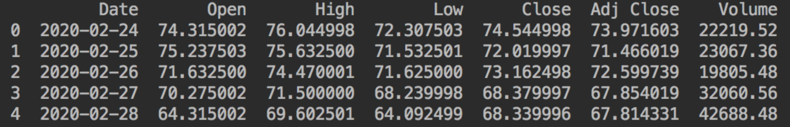
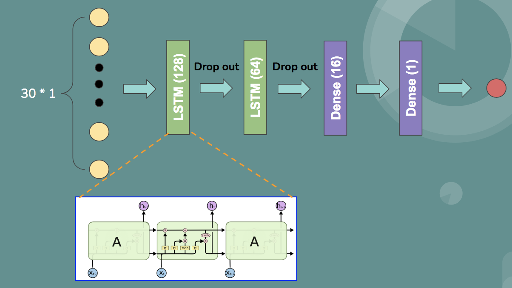
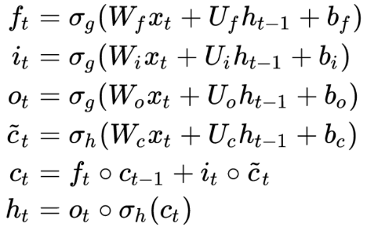
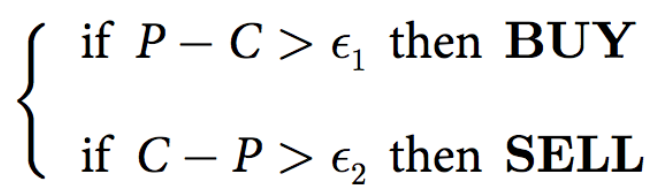
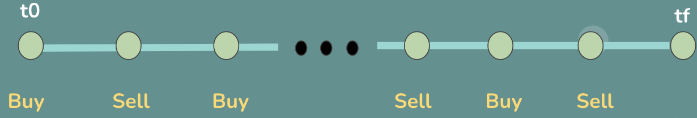
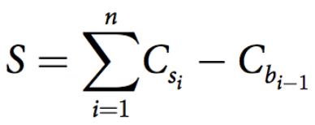
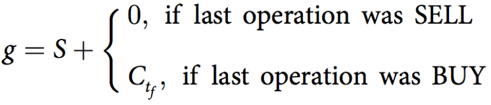
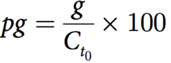
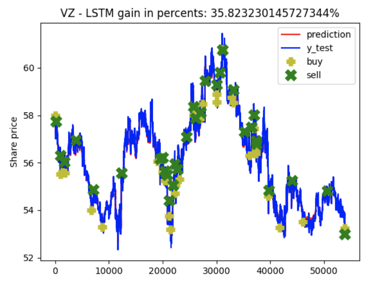

The final delivery for replicating the paper: "Deep architectures for long-term stock price prediction with a heuristic-based strategy for trading simulations".

## Description of the paper

Stock price prediction is a popular yet challenging task and deep learning provides the means to conduct the mining for the different patterns that trigger its dynamic movement. In this paper, the authors first build and train the deep learning model to predict the close price of the stock, then they propose a trading strategy based on the prediction, whose decision to buy or sell depend on two different thresholds. Finally, a hill climbing approach selects the optimal values for these parameters.

## Problem Statement

Based on the paper's description, the problem can be separated into three steps:

* Build the **Deep Learning model** to predict the **close price**. 
* Propose the **trading strategy**, whose decision to buy or sell depends on **two different thresholds**.
* A **hill climbing** approach selects the optimal values for these thresholds. 

(For the first step, the authors tried a CNN and LSTM model to fulfill the same goal (predicting the close price), and based on the final results showed in the paper, the prediction made by the LSTM model provides a larger gain during the trading process, and since this is a one person team, in this blog, I mainly choose to use the LSTM-based model to make the stock close price prediction.)

## Data 

The Datasets used in the paper is text-based type, a sample of the dataset (daily-frenquency) looks like:



To access these historical prices data, you can go to [data set link paper provided](https://doi.org/10.6084/m9.figshare.7976144.v1) or [Yahoo financial website](https://finance.yahoo.com/quote/AAPL/history?p=AAPL) to download the corresponding stock's data you would like to predict on. In this blog, we use the historical stock prices data provided in the course materials (minute-frenquency).

## Relevance

> Stock price prediction has been an evergoing challenge for economists but also for machine learning scientists. Different approaches have been applied over the decades to model either long-term or short-term behavior, taking into account daily prices and other technical indica- tors from stock markets around the world. During the last years, deep learning has also entered the stock market realm, particularly through its specific technique to model long-term data dependencies, the long short-term memory network (LSTM).
> - Catalin Stoean

With the success applications of deep learning methods in solving many regression problems, it is natural to bring it into the stock market realm. When talking about stock price prediction, recurrent nueral networks (RNN) will definitely be a good choice, since it makes well use of the temporal information inside its architecture. That's why the authors in the paper choose to use the LSTM model, which is a very well-known RNN model.

> There is also a practical aim to this study, regarding the subsequent trading simulation on the base of the deep learning predictions. The state of the art either employs a deterministic scheme (the literature entries using deep learning) or very complex evolutionary algorithms for trading rule generation (the papers using other machine learning techniques for predic- tion). In opposition, the approach presented in this paper parametrizes the BUY and SELL rules and determines the optimal variables through a simple HC heuristic.
> - Catalin Stoean

As the title has clearly illustrated, the author proposed a heuristic-based strategy for the following trading simulation. Instead of using very complex evolutionary algorithms for trading rule generation in the literature, the method they presented in the paper parametrizes the but and sell rules and determings the optimal variables through a simple HC heuristic.

## Methodologies

### Deep Learning Model

The LSTM-based model built for training is shown in the following: 



The input size has dimention 30 * 1, 30 represents the window size (time_steps), and the paper is predicting the close price, so the feature size is 1. Two LSTM layers and drop operaton are used in the middel with two dense layers in the end. The output is the predicted close price at the next time step.

The zoom in of LSTM cell looks like: 


and the functions used for calculating the gates, cell and hidden states of the cell is shown as:



Since we have leanred the details of LSTM's architecture during class, I won't explain for it repeatly. 

### Trading Strategy

Now we come to the trading stategy propsed in this paper



* P: predicted close price for time t+1.
* C: actual close price at time t.
* ϵ1 , ϵ2 : thresholds 

If the predicted close price at next time step is larger than the current close price for ϵ1 value, then we do the buy operation, if the current close price is larger thab the predicted close price at next time stip for ϵ2 value, then we do the sell operation. Besides, in the paper, the author assume that you only have one stock in hand, so you could only buy after selling, and vice versa. The first operation at time t0 is set to be buy. 

The transaction flow therefore would look like: 



Then we can calculate the gain without the last time step as following:



* S: Gain except for the last time step
* {s1, s2, . . ., sn} are the selling transactions
* {b0, b1,. . ., bn−1} are the buying operations
* Ck: the close price at operation k

So, you get positive gain whenever you sell the stock, while you get negative gain whenever you buy the stock.

Then the final gain can be computed by:



where if the last operation is sell, we no longer have stock in hand at the last time step, no extra gain, and if the last operation is buy, we can still sell it in the last time step and get extra gain Ctf.

Furthermore, we can also compute the final gain in percent, which is the final gain divided by the actual close price at t0, and times 100:



### Hill Climbing

Now, we have our DL model built, trading strategy proposed, only one question left -- how to choose the thresholds ϵ1 , ϵ2 in the trading strategy. The paper uses the so-called hill climbing approach to set the thresholds' value, I summarized the steps of this approach in the following:

1. **Range**: The two values are bounded to the interval given by 0 and one quarter of the difference between the maximum and the minimum value for the close price over the validation dataset.
2. **Normal distribution random sampling**: A mutation with normal distribution is used and the mutation strength is set as the quarter of the maximum value the two thresholds can have.
3. **Get the optimal pair**: The HC algorithm in charge of setting the optimal thresholds for buying and selling runs for 60 iterations, then pick out the ones provide max gain on validation dataset.
4. **Repeated runs during testing**: For overcoming the stochastic nature of the HC results, during testing,  the reported outcomes are averaged over 10 repeated runs.

## Codes

In this part, The main codes blocks for implementing the methodologies we described so far will be shown and explained. 

Python is used here, and for training the DL model, we mainly use tensorflow library. The main used libraies are shown here:

```python
import numpy as np
import pandas as pd
import math, time
import datetime
from keras.models import Sequential
from keras.layers.core import Dense, Dropout
from keras.layers.recurrent import LSTM
import matplotlib.pyplot as plt2
from os import makedirs
from os.path import exists, join
```

First, we need to get the stock data:

```python
def get_stock_data(stock_name, normalized=0):

    col_names = ['', 'v', 'vw', 'o', 'c', 'h', 'I', 't',
                 'n']
    stocks = pd.read_csv(stock_name, header = 0, names=col_names)
    df = pd.DataFrame(stocks)
    return df
```

(A note here, the datasets we are using here is the historical price data provided from the course materials.)

Then we need to load the data in order to fit in the DL model:

```python
def load_data(stock, seq_len):
    amount_of_features = len(stock.columns)
    data = pd.DataFrame(stock)
    sequence_length = seq_len + 1
    result = []

    for index in range(len(data) - sequence_length):
        result.append(data[index: index + sequence_length])

    result = np.array(result)
    row = round(0.8 * result.shape[0])
    row_1 = round(3/4 * row) # 60% train, 20% val
    train = result[:int(row_1), :]
    val = result[int(row_1):int(row), :]
    x_train = train[:, :-1]
    y_train = train[:, -1][:,-1]
    x_val = val[:, :-1]
    y_val = val[:, -1][:, -1]
    x_test = result[int(row):, :-1]
    y_test = result[int(row):, -1][:,-1]

    x_train = np.reshape(x_train, (x_train.shape[0], x_train.shape[1], amount_of_features))
    x_test = np.reshape(x_test, (x_test.shape[0], x_test.shape[1], amount_of_features))

    return [x_train, y_train, x_val, y_val, x_test, y_test]
```

Now you can load the data by doing:

```python
window = 30
X_train, y_train, X_val, y_val, X_test, y_test = load_data(df[::-1], window)
```

where you set the window size as 30.

you can also print to check the dimension of your data:

```python
# N could be different numbers
print("X_train", X_train.shape) # (N, 30, 1)
print("y_train", y_train.shape) # (N,)
print("X_val", X_val.shape) # (N, 30, 1)
print("y_val", y_val.shape) # (N,)
print("X_test", X_test.shape) # (N, 30, 1)
print("y_test", y_test.shape) # (N,)
```

After we get the data prepared, now we need to build our LSTM-based model:

```python
def build_model(layers):
    d = 0.2
    model = Sequential()
    model.add(LSTM(128, input_shape=(layers[1], layers[0]), return_sequences=True))
    model.add(Dropout(d))
    model.add(LSTM(64, input_shape=(layers[1], layers[0]), return_sequences=False))
    model.add(Dropout(d))
    model.add(Dense(16, activation='relu'))
    model.add(Dense(1, activation='linear'))
    model.compile(loss='mse', optimizer='adam', metrics=['accuracy'])
    return model
```

you can also check the built model by doing: 

```python
model = build_model([1, window, 1])
model.summary()
```

Then you can train your model with the prepared datasets, and test for the evaluation metrics on the testing datasets:

```python
model.fit(
    X_train,
    y_train,
    batch_size=128,
    epochs=50,
    verbose=1)

trainScore = model.evaluate(X_train, y_train, verbose=0)
print('Train Score: %.2f MSE (%.2f RMSE)' % (trainScore[0], math.sqrt(trainScore[0])))

testScore = model.evaluate(X_test, y_test, verbose=0)
print('Test Score: %.2f MSE (%.2f RMSE)' % (testScore[0], math.sqrt(testScore[0])))
```

You can then use the trained model to make the prediction on the val and test datasets:
```python
# predicted validation and test
p_val = model.predict(X_val)
p_test = model.predict(X_test)
```

Now we get our model built, trained and tested, we need to design the trading strategy:

```python
# Input: actual close price sequence (N, ), predicted close price sequence (N, 1), epsilon_1 (scalar), epsilon_2 (scalar)
# Output: Total gain, gain percent, buy_time, buy_price, sell_time, sell_price
# Purpose: Compute the gain (percent) during trading
# even though the function is named hill_climbing, but it is actually the trading strategy process
def hill_climbing(C_actual, P_predict, epsilon_1, epsilon_2):
    # record the buy and sell price and time
    buy_time = []
    buy_price = []
    sell_time = []
    sell_price = []
    flag = 0 # control buy-sell operations, 0 stands for "at buy state", 1 for "at sell state"
    s = 0
    s -= C_actual[0]
    buy_time.append(0)
    buy_price.append(C_actual[0])
    for index in range(len(C_actual) - 1):
        # sell
        if flag == 0 and C_actual[index] - P_predict[index+1][0] > epsilon_2:
            flag = 1
            s += C_actual[index]
            sell_time.append(index)
            sell_price.append(C_actual[index])
        # buy
        if flag == 1 and P_predict[index+1][0] - C_actual[index] > epsilon_1:
            flag = 0
            s -= C_actual[index]
            buy_time.append(index)
            buy_price.append(C_actual[index])
    if flag == 1:
        g = s
    else:
        g = s + C_actual[-1]
        sell_time.append(len(C_actual) - 1)
        sell_price.append(C_actual[-1])
    g = round(float(g), 8)
    pg = g / C_actual[0] * 100
    return g, pg, buy_time, buy_price, sell_time, sell_price
```

Finally, we implement the hill-climbing approch to get the optimal thresholds during testing, and record the gain and gain percent for the repeated 10 runs:
```python
# run for 10 times due to the statistic nature of HC
for i in range(10):
    epsilon_1_array = np.random.normal(mu, sigma, 60) # (60, )
    epsilon_2_array = np.random.normal(mu, sigma, 60)
    for index in range(len(epsilon_1_array)):
        if epsilon_1_array[index] < min:
            epsilon_1_array[index] = min
        if epsilon_1_array[index] > max:
            epsilon_1_array[index] = max
        if epsilon_2_array[index] < min:
            epsilon_2_array[index] = min
        if epsilon_2_array[index] > max:
            epsilon_2_array[index] = max

    g_val_list = []
    pg_val_list = []

    for index in range(len(epsilon_1_array)):
        g, pg, _, _, _, _ = hill_climbing(y_val, p_val, epsilon_1_array[index], epsilon_2_array[index])
        g_val_list.append(g)
        pg_val_list.append(pg)

    g_val_array = np.array(g_val_list)
    max_gain_index = g_val_array.argmax()

    # get the optimal epsilon_1 and epsilon_2
    epsilon_1 = epsilon_1_array[max_gain_index]
    epsilon_2 = epsilon_2_array[max_gain_index]

    # print("p shape", p.shape) # (695, 1)
    g_test, pg_test, buy_time, buy_price, sell_time, sell_price = hill_climbing(y_test, p_test, epsilon_1, epsilon_2)
    # print("gain for testing:", g_test)
    # print("gain percent for testing:", pg_test)
    pg_test_list.append(pg_test)
    epsilon_1_test_list.append(epsilon_1)
    epsilon_2_test_list.append(epsilon_2)

    if i == 0:
        pg_test_max = pg_test
        max_test_gain_percent_index = 0
        buy_time_max = buy_time
        buy_price_max = buy_price
        sell_time_max = sell_time
        sell_price_max = sell_price
    else:
        if pg_test > pg_test_max:
            pg_test_max = pg_test
            max_test_gain_percent_index = i
            buy_time_max = buy_time
            buy_price_max = buy_price
            sell_time_max = sell_time
            sell_price_max = sell_price
```

Finally, we will plot and save the prediction results with the trading process figure as our result image, and I choose to only show the results figure which has the maximum gain.

```python
# plot and save the max gain figure
plt2.plot(p_test, color='red', label='prediction')
plt2.plot(y_test, color='blue', label='y_test')
plt2.plot(buy_time_max, buy_price_max, 'y+', label='buy', mew=5, ms=10)
plt2.plot(sell_time_max, sell_price_max, 'gx', label='sell', mew=5, ms=10)
plt2.ylabel('Share price')
plt2.title("{} - LSTM gain in percents: {:2}%".format(comany_name, pg_test_list[max_test_gain_percent_index]))
plt2.legend(loc='upper right')
# plt2.show()
plt2.savefig(path_save_result_images + '{}.png'.format(max_test_gain_percent_index))
```
The final model will be named HC-LSTM, and the results figure will be further shown and explained in the next section.

## Results

The following is the result figure of HC-LSTM model used on stock VC: 



* Test Score: 0.009MSE (0.10 RMSE)
* epsilon_1: 0.25
* epsilon_2: 0.32 
* Max gain percent: 35.82%
* Average gain percent: 11.62%

We can see that the our model provides a very precise prediction. Following the trading strategy and hill-climbing thresholds choosing strategy, we get an average 11.62% gain percent, and 35.82% max gain percent. 

More results of different stocks will be shown in ./src directory with the name "*_stock", we can see from all these results that our model did a good job in prediction, and we get the positive gain in most of the cases.


## Commands for Using the Model

The traing and testing has been combined in the same python script -- train.py , after you change the absolute path directory in the script (or you can change the codes a little bit to input the pathes in the commands, either way works), you can directly run:

*python train.py*

you will get the model trained and tested, saving out the result figure of the stock you choose and a log.txt file with all the important information written in.


